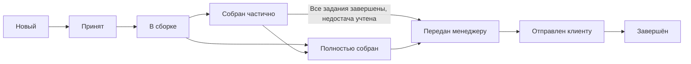

# Архитектура ERP/WMS frontend

Активное приложение — ролевой прототип на React, TypeScript, Mantine и React Router. Все экраны используют одну модель `entities/wholesale`. Изменение заказа в интерфейсе клиента, сборщика или менеджера обновляет одно и то же состояние; отдельных копий данных для экранов нет.

## Слои и публичные точки входа

```text
src/
├── main.tsx                         # вызов app.bootstrap
├── app/
│   ├── App.tsx                      # маршруты и ограничения ролей
│   ├── entrypoint.tsx               # React, MantineProvider, HashRouter
│   └── styles/                      # тема, шрифты и общие стили
├── pages/
│   ├── sign-in/                     # ролевой вход
│   ├── storefront/                  # клиентский каталог и товар
│   ├── client-cart/                 # корзина и подтверждение заказа
│   ├── client-profile/              # профиль и история клиента
│   ├── operations/                  # обзор, заказы, сборка, склады, журнал
│   ├── administration/              # редакторы пользователей, складов, товаров
│   ├── login/                       # сохранённый экран входа PHP
│   └── catalog/                     # сохранённый каталог PHP
├── widgets/
│   ├── workspace-shell/             # навигация, поиск заказов, уведомления
│   └── ...                          # сохранённые виджеты PHP-каталога
├── features/
│   ├── auth-login/                  # сохранённая авторизация PHP
│   └── manage-cart/                 # сохранённая серверная корзина
├── entities/
│   ├── wholesale/
│   │   ├── index.ts                 # публичный API модели
│   │   └── model/
│   │       ├── types.ts             # пользователи, товары, склады, заказы
│   │       ├── seed.ts              # начальные данные и аккаунты
│   │       ├── store.ts             # команды и бизнес-проверки
│   │       ├── persistence.ts       # чтение и проверка сохранённого состояния
│   │       ├── use-wholesale.ts     # подписка React на store
│   │       └── helpers.ts           # видимость, метки, суммы, даты, прогресс
│   ├── session/                     # сохранённый контракт авторизации PHP
│   ├── product/                     # сохранённый контракт товара PHP и UI
│   └── cart/                        # сохранённый контракт корзины PHP
└── shared/
    ├── api/                         # общий HTTP-транспорт для PHP
    ├── config/                      # настройки сохранённого транспорта
    └── ui/                          # независимые элементы интерфейса
```

Правило зависимостей:

```text
app → pages → widgets → features → entities → shared
```

Можно пропускать промежуточные слои: например, страница каталога обращается прямо к `entities/wholesale`. Слайсы одного слоя не импортируют друг друга. Внешние импорты проходят через публичный `index.ts` или `index.tsx`; прямые пути к `model`, `ui` и `api` допустимы только внутри своего слайса. `shared` не зависит от предметных слоёв. Его независимые модули имеют собственные публичные входы, например `shared/api/index.ts` и `shared/ui/status-badge/index.tsx`.

`main.tsx` зависит только от `app/index.ts`. Маршруты, провайдеры и композиция экранов находятся в `app`; CSS компонентов хранится рядом с UI, общие стили — в `app/styles`. Страницы клиентского каталога, корзины и профиля используют собственные префиксы CSS, чтобы не смешиваться со стилями сохранённого каталога.

## Единая модель прототипа

Публичный `entities/wholesale/index.ts` экспортирует `store`, `useWholesale`, типы, подписи статусов и форматирование. `useWholesale()` возвращает `{ state, user }` и подписывается через `useSyncExternalStore`.

| Данные | Назначение |
| --- | --- |
| `users`, `sessionUserId` | Аккаунты, роли, активность, назначенные склады, права, профиль магазина и текущий вход |
| `warehouses` | Категории склада, цвет и ряды хранения |
| `products` | Товар, цена, доступный остаток, единица, склад, стеллаж и полка |
| `carts` | Корзина каждого клиента: `userId → productId → quantity` |
| `orders` | Снимок позиций и цен, адрес, приоритет, комментарий, статусы и задания складов |
| `events`, `notifications` | Журнал действий и уведомления пользователей |

Связанные сущности объединены в один слайс `wholesale`, поскольку оформление заказа, резервирование остатков и создание заданий должны изменяться согласованно. Страницы не меняют `state` напрямую: снимки заморожены, а команды работают с копией и публикуют её после успешной проверки. Для изменения порядка элементов UI сначала создаёт собственную копию или выборку массива.

Основные команды:

- `login`, `logout`, `updateProfile` — вход и профиль без изменения роли через форму клиента.
- `setCartItem` — установка целого количества; `0` удаляет позицию. Проверяются роль, доступность и остаток.
- `checkout` — проверка всей корзины, создание снимка заказа, резервирование всех позиций, создание заданий по складам и очистка корзины клиента за одно изменение состояния.
- `acceptTask`, `startTask`, `setPicked`, `finishTask` — складской цикл с проверкой назначенного сотрудника и склада.
- `handoff`, `ship`, `complete` — передача менеджеру, отгрузка и подтверждение получения.
- Команды редактирования пользователей, складов и товаров — проверки прав и связанных данных перед сохранением.
- `readNotice`, `resetDemo` — прочтение уведомления и административный сброс демонстрации.

Цены и названия позиций сохраняются в заказе как снимок: последующее изменение каталога не переписывает историю. Собранное количество и недостача хранятся отдельно. Завершение задания требует учесть всё заказанное количество; передача менеджеру требует завершить задания всех задействованных складов.

## Жизненный цикл заказа



Общий складской статус вычисляется по заданиям и позициям. Частичная сборка может означать незавершённую работу нескольких складов или зафиксированную недостачу. Она не позволяет обойти проверку завершения всех заданий перед передачей менеджеру. Назначенный сборщик отвечает только за свои задания; менеджер или администратор подтверждает отгрузку, а владелец заказа может подтвердить получение после неё.

## Роли и маршруты

`app/App.tsx` ограничивает доступ к группам маршрутов, а команды store повторно проверяют допустимость действий. Клиент видит только свои заказы; сборщик — заказы и задания назначенных складов; менеджер и администратор получают общую операционную картину.

- Общие защищённые маршруты: `/dashboard`, `/orders`, `/orders/:id`, `/activity`.
- Клиент: `/catalog`, `/cart`, `/profile`.
- Сборщик: `/tasks`; карта `/warehouses` также доступна менеджеру и администратору.
- Менеджер и администратор: `/team`.
- Администратор и менеджер с назначенными правами управления: `/admin`. Менеджер видит только разрешённые вкладки; выдавать права или редактировать администраторов он не может.

Используется `HashRouter`: адреса имеют вид `/#/orders/…`, поэтому статическому серверу не нужен rewrite для внутренних маршрутов. Текущая ролевая модель предназначена для прототипа; она не заменяет серверную авторизацию.

## Сохранение состояния

Начальные данные создаются в `seed.ts`. Store читает `localStorage` по ключу `wholesale-workspace-v1`; `persistence.ts` проверяет версию, типы и связи загруженного состояния. При отсутствии или некорректности данных загружается исходный набор. После каждой успешной команды обновляются подписчики и сохранённое состояние; если browser storage недоступен, store продолжает работать в памяти.

Перезагрузка сохраняет прогресс и текущий аккаунт. Событие `storage` синхронизирует вкладки одного origin; текущая сессия также общая. Это локальное браузерное состояние, без серверной синхронизации между устройствами.

`resetDemo()` разрешён администратору. Сброс через экран администрирования восстанавливает начальные данные, сохраняет активным аккаунт администратора и записывает событие. Пароли в этой модели являются публичными демонстрационными значениями; реальные учётные данные в неё не предназначены для загрузки.

## Сохранённая PHP-интеграция

Модули `shared/api`, `entities/session`, `entities/product`, `entities/cart`, `features/auth-login` и `features/manage-cart` сохранены после предыдущего этапа. Их старые страницы `pages/login` и `pages/catalog` не подключены к активным маршрутам. Новый `entities/wholesale` не импортирует PHP-транспорт.

PHP-запросы, включая нестандартные GET-операции корзины и особенности ответов, описаны в [backend-api.md](./backend-api.md). Старые параметры окружения `VITE_API_BASE_URL`, `VITE_DEMO_MODE` и `API_PROXY_TARGET` относятся именно к этой интеграции; они не меняют источник данных ролевого прототипа.

Для подключения нового UI к серверу потребуется отдельный адаптер для пользователей, ролей, складов, заданий, заказов и событий. Существующие PHP-файлы и подключение к БД в рамках фронтенд-работы не изменялись и не запускались.

## Проверки

```bash
npm run build
npm run lint
npm test
```

[tests/architecture.test.ts](../tests/architecture.test.ts) проверяет направление зависимостей, публичные точки входа, существование локальных импортов и границу `main.tsx → app`. Проверка учитывает TypeScript-импорты, реэкспорты, динамические импорты, `require()` и CSS `@import`; положительные и отрицательные примеры контролируют сам валидатор.

Контрактные проверки сохранённого API используют тестовые ответы и не требуют PHP. Поведение интерфейса и полного ролевого сценария нужно проверять отдельно от структурных правил FSD; ни сборка, ни локальные тесты не подтверждают доступность реального PHP-сервера или БД.
